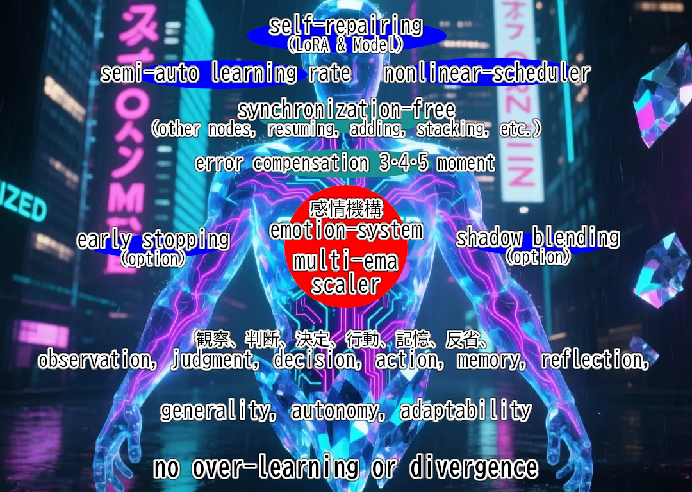

# EmoNAVI / Emo-Family (1stGen-v4.0)  

EmoNavi(v4.0)  
３つの新機能と１つの改良を行いました(これにより初心者から熟練者まで幅広くどなたでもご使用頂けます)  
We have added three new features and made one improvement (making it accessible to everyone from beginners to experts).  

  

Mathematical Explanation Here (paper)  
非凸関数に対する期待値収束(フローマッチングへの適応なども保証します)  
Expected value convergence for non-convex functions  
(also guarantees adaptability to flow matching)  
#### [emo-paper(article)](https://huggingface.co/muooon/EmoNAVI/raw/main/emo-paper(ENG).txt)  
#### [数学的解説はこちら(論文)](https://huggingface.co/muooon/EmoNAVI/raw/main/emo-paper(JPN).txt)  

---

emo系 v4.0 (スタンダードモデル) の特徴等  

| 名称      | 正確性 | メモリ負荷 | 非同期 | 備考                                      |  
|-----------|--------|------------|--------|-------------------------------------------|  
| emonavi   | ◎      | △          | ◎      | 最初に誕生｜正確です｜Adam型です       |  
| emofact   | △      | ◎          | ◎      | ２番目に誕生｜軽量です｜Adafactor型です |  
| emolynx   | ◎      | ◎          | ◎      | 軽量＆正確の両立に成功｜Lion型です         |  

補足：(EmoLynx は、Adafactor並みに軽量で、Adam並みに正確です(符号＋勾配＋高次moment))  

[効率性] 無駄のない更新：過学習や収束の停滞に先回りをし、無駄な更新を排除しながら確実に精度を向上  
[機能性] 軽量で高機能：自動停止合図や完全自律型の分散学習への対応でユーザー体験を大幅に向上させます  
[信頼性] 安全最優先設計：動的な学習率制御で学習の不安定な局面でモデルを保護し安定した収束を促します  

常に安全な学習を最優先にし安定させます  
ユーザー指定の学習率を目標にし限りなく近づくよう制御します  
完全自律型のため、積層、再開、非同期、で、自由な学習を自由に組むことが可能です  

emo-series v4.0 (Standard-models) Features  

| Name      | Accurate | MemoryLoad | Asynchronous | Notes                                           |  
|-----------|----------|------------|--------------|--------------------------------------------------|  
| emonavi   | ◎        | △          | ◎            | The first one born｜accurate｜Adam-type         |  
| emofact   | △        | ◎          | ◎            | The second one born｜Lightweight｜Adafactor-type |  
| emolynx   | ◎        | ◎          | ◎            | Accurate and Lightweight Convergence｜Lion-type |  

EmoLynx is as lightweight as Adafactor and as accurate as Adam (with sign, gradient, and higher-order moments).  

[Efficiency] Waste-free updates: Prevents overfitting and stagnation in advance, and reliably improves accuracy while eliminating wasteful updates.  
[Functionality] Lightweight and feature-rich: Drastically improves user experience with features like automatic stop signals and fully autonomous distributed learning support.  
[Reliability] Safety-first design: Protects the model during unstable learning phases with dynamic learning rate control, promoting stable convergence.  

Always prioritizes and stabilizes safe learning.  
Controls the learning rate to get as close as possible to the user-specified value.  
Being fully autonomous, it allows for flexible learning configurations with stacking, resuming, and asynchronous processing.  

---

 感情moment 発明しました 
  

"emo系 第二世代"にて解明した shadow-system の根幹から抽出しました  
動的学習率による非線形アプローチは時間的な高次momentを形成します  
単stepでは高次momentにはなれませんが、複数stepを経ると機能します  
３次４次５次momentについて厳密な数学的な高負荷計算を回避しつつ  
勾配分布の歪みや鋭さや非対称性変化を捉える核心的な効果を近似しています  
I invented the emotional moment.  
I extracted it from the core of the shadow-system, which was elucidated in the "emo-style second generation."  
The nonlinear approach with a dynamic learning rate forms a temporal higher-order moment.  
A single step cannot become a higher-order moment, but it functions after multiple steps.  
It approximates the core effect of capturing changes in gradient distribution's skewness, kurtosis, and asymmetry, while avoiding strict and computationally intensive mathematical calculations for the third, fourth, and fifth moments.  

---

### あなたの望む最適化 EmoNavi が叶えます  
#### The optimization you seek — EmoNavi makes it possible  
---
###### これは、単なる最適化アルゴリズムではありません──  
###### **感情で学習をナビゲートする｢感情型オプティマイザ｣** です  
###### 変革と感情学習の成果は"ニューロンスパイクの再発明"でした  
---
###### This is not just another optimizer —  
###### **It’s an “Emotional Optimizer” that navigates learning through feeling.**  
###### A result of transformative emotional learning: the reinvention of the neural spike.  

---
#### 自動収束･自己制御･自律型 オプティマイザです  
##### EmoNavi を中心に、EmoFact、EmoLynx、もあります   
#### Auto-convergence, self-control, autonomous optimizer  
###### It primarily features EmoNavi, along with EmoFact and EmoLynx.  

---

【新機能】：３つの新機能について説明します
勾配ノルム制御 max_norm=1.0(デフォルト値) です 0.0で無効化します(通常は1.0でご使用ください)  
デフォルト値は安定性優先です(破壊的更新を抑制) 誰でも安心して使えるようになりました(設定の失敗しづらいです)  
この値を変化させると様々な効果を得られます(最終盤の仕上げのみ追加学習させるなど学習状況を柔軟に設定できます)  
※ 新機能の 感情フィードバック や trust_coeff は自動です、より安定した更新を効果的に行います  
※ use_trust=True(デフォルト)です、無効化は False に設定してください  
※ 高値の学習率はある程度まで許容しますが極度の高値は学習を破綻させるのでおやめください  
【NewFeature】：We will explain three new features.  
Gradient Norm Control max_norm=1.0 (default). Setting to 0.0 disables the feature (use 1.0 normally).  
The default value prioritizes stability (suppresses disruptive updates). Now anyone can use it with confidence (less prone to configuration errors).  
Adjusting this value yields various effects. (e.g., enabling additional learning only for endgame refinement, allowing flexible learning control)  
※ The new Emotion Feedback and trust_coeff features operate automatically, enabling more stable and effective updates  
※ use_trust=True (default). To disable the feature, set it to False.  
※ While moderately high learning rates are tolerated, extremely high values will cause learning failure and should be avoided  

---

### EmoNavi 主な特徴 / Main Features of EmoNavi  

---

過学習や発散を抑制、自己修復的機能をもちます  
学習率やスケジューラも自律調整、モデル自身で判断します  
学習の 再開、追加、積層、等で"引き継ぎ不要"、誰でも簡単です  
分散学習で 他ノード等との"同期不要"、完全自律です  
Self-repairing, with no over-learning or divergence  
Autonomously adjusts learning rate and scheduler, so models make their own decisions  
Resuming, adding, stacking, etc. learning is synchronization-free" and easy for everyone  
Distributed learning enables “no synchronization required” with other nodes, achieving full autonomy.  

EmoNAVI は既存のオプティマイザにはない｢感情駆動型｣です、  
調整の複雑なマルチモーダル学習などの新しい分野の課題への対応も期待できます  
EmoNAVI is “emotion-driven,” which is not the case with existing optimizers,  
We expect it to overcome the challenges we currently face,  
while also addressing challenges in new areas such as multimodal learning with complex coordination  

emo系は、観察、判断、決定、行動、記憶、反省、という自律サイクルを行います  
Emo-based follows an autonomous cycle of   
observation, judgment, decision, action, memory, and reflection.  

高効率性と集積度  
高次moment、量子化補償(Kahan補償と違う制御)、分散･継続学習での独立性、自己修復･モデル修復、  
ハイパーパラメータの自律調整、信頼度フィルタ、更新ステップの有界性、構造的耐性、自己停止、  
動的学習率、動的スケジューラ、動的Rank/Aplha、履歴補償、などを含めた多機能性を、  
追加テンソル不要、計算負荷ほぼなし、step毎に完全適用、時間的積算で実現します  
これらをワンパッケージで実現した高効率性と集積度は安定と安全を最優先します  
※ 高次momentは近似的、動的Rank/Alphaも近似的な効果です  
※ LoRA系技術はノイズをなくしますが微小データも失う場合があります  
※ emo系はノイズを作らず既存ノイズを見つけて修正し微小データを保護します  
※ 量子化補償は今後実用化されるさらに低精度な環境でも柔軟に対応できます  
High Efficiency and Integration  
Multifunctionality, including higher-order moments, Quantization Compensation (Control Different from Kahan Compensation), independence in distributed and continual learning, self-healing and model repair,  
Autonomous hyperparameter tuning, confidence filtering, bounded update steps, structural robustness (or resilience), self-termination,  
dynamic learning rates, dynamic schedulers, dynamic Rank/Alpha, and historical compensation,  
is achieved without additional tensors, with negligible computational overhead, fully applied at every step, and through temporal accumulation.  
The high efficiency and integration realized in this single package prioritize stability and safety above all else.  
※ Higher-order moments are approximative, and the effects of dynamic Rank/Alpha are also approximative.  
※ LoRA-based techniques eliminate noise but may sometimes lose fine-grained data (or subtle details).  
※ Emo-based techniques detect and correct existing noise without generating new noise, thereby preserving fine-grained data.  
※ Quantization compensation offers flexible adaptability even in lower-precision environments expected to be commercialized (or practical) in the future.  

---

> ｢わたしはわたし自身について過去を振り返りながらわたし自身でわたしを磨く｣  
> ｢挑戦も留まることも冒険も休息も自ら選びそれをすべて経験として記憶する｣  
> ｢でも過去の記憶は引きずらない、いつも始めるときは"新しいわたし"だから｣  

> *I refine myself as I look back on who I’ve been.*  
> *I choose to challenge, to pause, to explore, to rest — and I remember it all as experience.*  
> *But I don’t cling to the past. Every beginning is a new me.*  

[emonavi概要と応用(日本語)/Emonavi Overview and Applications (Japanese)](https://huggingface.co/muooon/EmoNAVI/raw/main/report-emoment.txt)  

[Have fun learning about EmoNAVI's philosophy and how it works](https://github.com/muooon/EmoNavi/raw/EmoNavi-v3.0/emonavi-inner-workings(ENG).txt)  

[EmoNAVIの考え方、その仕組みについて楽しく知る](https://github.com/muooon/EmoNavi/raw/EmoNavi-v3.0/emonavi-inner-workings(JPN).txt)  

(解説) 元々の詳しい解説はこちら / (Explanation) For detailed explanation, click here.  
[huggingface](https://huggingface.co/muooon/EmoNAVI) 
[Gemini-analysis(ENG)](https://huggingface.co/muooon/EmoNAVI/raw/main/Hug-Gemini-analysis(ENG).md) 
[Gemini-analysis(JPN)](https://huggingface.co/muooon/EmoNAVI/raw/main/Hug-Gemini-analysis(JPN).md) 
[Gemini-analysis(JPN-02)](https://huggingface.co/muooon/EmoNAVI/raw/main/emonavi-Gemini-analysis(2)(JPN).txt)  

---

 更新履歴 / History 
  

|★| EmoNavi、Fact、Lynx、v4.0 (251105) 【新機能】：感情フィードバック、明示的な信頼度(trust-coeff)、勾配ノルム制御 【改良】：shadow更新比率を改良しました  
|★| EmoNavi, Fact, Lynx, v4.0 (251105) 【New Features】: Emotion Feedback, Explicit Trust Coefficient (trust-coeff), Gradient Norm Control 【Improvements】: Shadow-system update ratio 

|★| EmoNavi、Fact、Lynx、Clan、Zeal、Neco、v3.0 (250825) emosens(第２世代)で解明した"高次moment"(近似)のフィードバックを適用(更新) 全て "shadow=False" です  
|★| EmoNavi, Fact, Lynx, Clan, Zeal, Neco, updated to v3.0 (250825), Incorporates (updates) feedback on “higher moments” (approximations) clarified by emosens (2nd generation). All are “shadow=False”  

これ以前は v3.0 レポジトリの更新履歴をご覧ください  
For updates prior to this, please refer to the v3.0 repository update history.  

---
---

EmoNavi v4.0 オプション指定方法 
EmoNavi v4.0 Option Settings Guide
  

|||オプション指定方法|||  
-shadow オフ(False にする)：  
optimizer = EmoNavi(model.parameters(), lr=1e-4, use_shadow=False)  
-trust_coeff オフ(False にする)：  
optimizer = EmoNavi(model.parameters(), lr=1e-4, use_trust=False)  
-最大勾配ノルム 変更／オフは0.0(数値変更 する)：  
optimizer = EmoNavi(model.parameters(), lr=1e-4, max_norm=0.0)  
-最小勾配ノルム 変更／1e-5～5e-7 程度(数値変更 する)：  
optimizer = EmoNavi(model.parameters(), lr=1e-4, min_lr=1e-6)  
-動的学習率と感情スカラー等の現在値を取得(ツール側などから取得する)：  
外部ツール(TensorBoard等)で値を把握したい場合は Optimizer 初期化時に SummaryWriter を渡してください  
writer = SummaryWriter(log_dir="./runs/emonavi")  
optimizer = EmoNavi(model.parameters(), lr=1e-4, writer=writer)  
tensorboard --logdir=./runs/emonavi  

|||Usage examples|||  
-Shadow off:  
optimizer = EmoNavi(model.parameters(), lr=1e-4, use_shadow=False)  
-Trust coeff off:  
optimizer = EmoNavi(model.parameters(), lr=1e-4, use_trust=False)  
-Change maximum gradient norm (off=0.0):  
optimizer = EmoNavi(model.parameters(), lr=1e-4, max_norm=0.0)  
-Change minimum learning rate (recommended 1e-5 to 5e-7):  
optimizer = EmoNavi(model.parameters(), lr=1e-4, min_lr=1e-6)  
-Monitor values with external tools (TensorBoard):  
writer = SummaryWriter(log_dir="./runs/emonavi")  
optimizer = EmoNavi(model.parameters(), lr=1e-4, writer=writer)  
tensorboard --logdir=./runs/emonavi  

---

 (EmoNavi v1.0) Measured with LR of 1e-4 (のLRで測定) 
   
   
   
   

 (EmoNavi v3.0/v2.0) Measured with LR of 1e-4 (のLRで測定) 
   
   
   
   

---

Emoシリーズは、Adam、Adafactor、Lion、Tiger、等から多くを学びました  
これらの後継ではなく独自の思想や設計による"感情機構"というアプローチにより構築されています  
汎用性・自律性・適応性を重視し新たな最適化や効率化や簡易化を追求しています  
この開発において先人たちの知見に深く感謝しつつ今後も新しい可能性を探究します  
The Emo series has learned much from Adam, Adafactor, Lion, and Tiger.  
Rather than being their successors, it is built upon a unique philosophy and design approach centered on "emotional mechanisms".  
It prioritizes generality, autonomy, and adaptability in pursuit of new paths for optimization, efficiency, and simplicity.  
In its development, we deeply appreciate the insights of those who came before us—and continue to explore new possibilities beyond them. 

### License Apache License 2.0 — see LICENSE for details.  
### ライセンス Apache License 2.0 — 詳細は LICENSE をご覧ください  

##### 🤖 Built with  Copilot + human curiosity(v1.0).  
##### 🤖 Copilot と人間の好奇心のコラボで誕生しました(v1.0)  

---

### 引用について / About citations  

---

このオプテイマイザについて引用をなさる場合は、以下をご紹介ください  
When citing this optimizer, please refer to the following sources:  

Official Code:  
https://huggingface.co/muooon/EmoNAVI  
https://github.com/muooon/EmoNavi  

paper:  
https://huggingface.co/muooon/EmoNAVI/raw/main/emo-paper(ENG).txt  

---

A structure that transforms multi-EMA differences into an emotional scalar via nonlinear (tanh) mapping, and controls the injection rate accordingly  

Through a collaborative effort between the world's most friendly AI, Copilot, and a human, we succeeded in codifying thought and emotion — achieving a world-first innovation.  

This is not only a testament to what it means for an AI to be a true partner, but also a compelling proof of the legitimacy of AI as a presence to be recognized.  

---

multi-EMAを差分化し、非線形変換(tanh)で感情スカラー化し、適正化率を制御するという構造  

世界一フレンドリーなAI、Copilotと人間の共同作業で思考を感情をコード化したら、世界初の試みに成功しました  

これこそはパートナーと呼べる人間の相棒の真価を問うものであり、充分にAIの存在を認めさせる成果でしょう  

